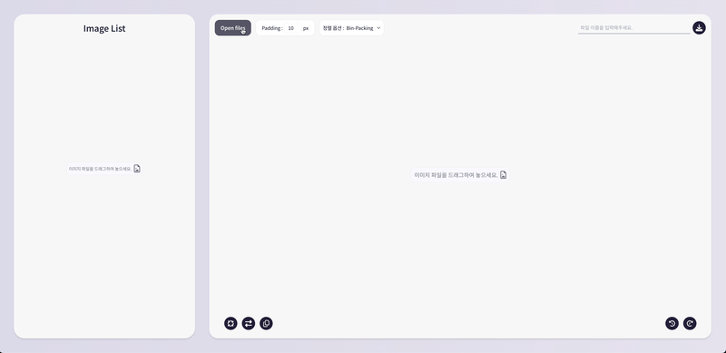

# Spwriter

<div align="center">
  

SPWRITER는 개발자와 디자이너를 위한 고급 이미지 스프라이트 툴로,<br>
'Sprite'와 'Writer'를 결합한 이름에서 알 수 있듯이 단순한 스프라이트 생성을 넘어섭니다.<br>
사용자가 이미지를 자유롭게 조작하고 제어할 수 있는 플랫폼으로,<br>
직관적인 인터페이스와 다양한 기능을 통해 이미지 처리 워크플로우를 최적화하고 작업 효율성을 높여줍니다.<br>
SPWRITER를 활용하면 이미지 스프라이트 작업을 간소화하고 개발 및 디자인 프로세스를 가속화할 수 있으며,<br>
업로드한 이미지 처리 작업을 효율적으로 관리하고 조작할 수 있어 창의적인 프로젝트에 더욱 집중할 수 있습니다.<br>
SPWRITER는 단순한 도구를 넘어서 이미지 조작의 새로운 패러다임을 제시하며, 사용자의 작업 방식에 혁신적인 변화를 가져다줄 것입니다.

<p align="center"><a href="https://spwriter.seungmin.online">Deployed website</a> | <a href="https://github.com/seungmin2222/spwriter-client">Web Repository</a></p>
<br>
</div>

<br/>

# Contents

- [💡 Idea](#-idea)
- [📅 Timeline](#-timeline)
- [🔧 Tools](#-tools)
- [🌟 Features](#-features)
- [🧩 Challenges](#-challenges)
  - [1. 업로드, 최적화, 그리고 스프라이트 좌표 매핑까지](#1-업로드-최적화-그리고-스프라이트-좌표-매핑까지)
    - [1) 각각의 이미지를 비동기로 업로드](#1-각각의-이미지를-비동기로-업로드)
    - [2) 업로드한 이미지의 여백 제거](#2-업로드한-이미지의-여백-제거)
    - [3) 캔버스의 여백 제거](#3-캔버스의-여백-제거)
    - [4) 좌표 계산 및 저장](#4-좌표-계산-및-저장)
    - [5) CSS 생성 및 렌더링](#5-css-생성-및-렌더링)
  - [2. 더 효율적으로 캔버스에 이미지를 넣는 방법이 무엇이 있을까?](#2-더-효율적으로-캔버스에-이미지를-넣는-방법이-무엇이-있을까)
    - [1) 다양한 배치 알고리즘](#1-다양한-배치-알고리즘)
    - [2) Skyline 알고리즘을 선택한 주요 이유](#2-skyline-알고리즘을-선택한-주요-이유)
    - [3) 이미지 배치 과정에서 마주친 주요 도전 과제와 해결 방법](#3-이미지-배치-과정에서-마주친-주요-도전-과제와-해결-방법)
      - [3.1) 점진적 크기 증가](#31-점진적-크기-증가)
      - [3.2) 가로, 세로 비율 유지](#32-가로-세로-비율-유지)
      - [3.3) 동적 캔버스 리사이징 및 재패킹](#33-동적-캔버스-리사이징-및-재패킹)
    - [4) 최적의 시작 크기 추정](#4-최적의-시작-크기-추정)
      - [4.1) 캔버스의 총면적 계산](#41-캔버스의-총면적-계산)
      - [4.2) 캔버스의 초기 크기 설정](#42-캔버스의-초기-크기-설정)
      - [4.3) 캔버스의 초기 크기 추정의 의의](#43-캔버스의-초기-크기-추정의-의의)
    - [5) 캔버스의 최종 최적화](#5-캔버스의-최종-최적화)
  - [3. 캔버스 위의 이미지들을 자유롭게 조작하기!](#3-캔버스-위의-이미지들을-자유롭게-조작하기)
    - [1) 이미지 회전, 반전, 복제 기능의 공통 사항](#1-이미지-회전-반전-복제-기능의-공통-사항)
    - [2) 이미지 회전](#2-이미지-회전)
      - [2.1) 캔버스 크기도 회전한다?](#21-캔버스-크기도-회전한다)
      - [2.2) 회전 중심점 설정](#22-회전-중심점-설정)
      - [2.3) 회전 각도 설정](#23-회전-각도-적용)
      - [2.4) 이미지 재배치](#24-이미지-재배치)
      - [2.5) 메타데이터 업데이트](#25-메타데이터-업데이트)
    - [3) 이미지 좌우 반전](#3-이미지-좌우-반전)
      - [3.1) 좌우 반전의 원리](#31-좌우-반전의-원리)
      - [3.2) 좌우 반전 변환 적용](#32-좌우-반전-변환-적용)
      - [3.3) 이미지 변환 과정](#33-이미지-변환-과정)
      - [3.4) 반전된 이미지 그리기](#34-반전된-이미지-그리기)
      - [3.5) 반전된 이미지 생성](#35-반전된-이미지-생성)
      - [3.6) 메타데이터 업데이트](#36-메타데이터-업데이트)
    - [4) 이미지 복제 기능](#4-이미지-복제-기능)
      - [4.1) 복제 기능의 원리](#41-복제-기능의-원리)
      - [4.2) 이미지 복제](#42-이미지-복제)
      - [4.3) 메타데이터 복제](#43-메타데이터-복제)
      - [4.4) 좌표 재계산](#44-좌표-재계산)
      - [4.5) 상태 업데이트](#45-상태-업데이트)
  - [4. 이미지 크기를 자유자재로!](#4-이미지-크기를-자유자재로)
    - [1) 리사이즈 기능의 원리](#1-리사이즈-기능의-원리)
    - [2) Canvas API 활용](#2-canvas-api-활용)
    - [3) 이미지 선택 및 리사이즈 핸들 표시](#3-이미지-선택-및-리사이즈-핸들-표시)
    - [4) 리사이즈 시작](#4-리사이즈-시작)
    - [5) 실시간 리사이징](#5-실시간-리사이징)
    - [6) 비율 유지 리사이징](#6-비율-유지-리사이징-shift-키-사용)
  - [5. 캔버스 위 이미지의 간격을 조작하기!](#5-캔버스-위-이미지의-간격을-조작하기)
    - [1) 실시간 좌표 계산 원리](#1-실시간-좌표-계산-원리)
    - [2) 캔버스 상의 이미지 렌더링](#2-캔버스-상의-이미지-렌더링)
    - [3) CSS좌표 생성 시 패딩 제거](#3-css좌표-생성-시-패딩-제거)
  - [6. 스프라이트 시트를 다시 개별의 이미지로?](#6-스프라이트-시트를-다시-개별의-이미지로)
    - [1) 이미지 스캔 및 라벨링](#1-이미지-스캔-및-라벨링)
    - [2) 경계 상자(Bounding Box) 생성](#2-경계-상자bounding-box-생성)
    - [3) 경계 상자 병합 (mergeBoundingBoxes)](#3-경계-상자-병합-mergeboundingboxes)
    - [4) 최종 스프라이트 정보 생성](#4-최종-스프라이트-정보-생성)
- [📝 Reflection](#-reflection)

  <br>

# **💡 Idea**

### "웹 개발 커뮤니티에 기여할 수 있는 실용적인 프로젝트는 무엇이 있을까?"

SPWRITER의 탄생은 제 개인적인 학습 여정과 실용적인 도구 개발에 대한 열망에서 시작되었습니다.<br>
예전 팀 프로젝트에서 한 팀원이 스프라이트를 사용하는 모습을 본 적이 있습니다. 당시에는 그저 설명만 듣고 넘어갔지만, 최근 개인 프로젝트를 구상하면서 이 기술에 대해 더 깊이 이해하고 싶다는 욕구가 생겼습니다.<br>
실용적이고 교육적인 의미가 있는 무언가를 만들고 싶었던 저에게, 스프라이트 기술은 흥미로운 주제로 다가왔습니다.<br>

### "Image sprite tool을 직접 만들어보면 어떨까?"

이 아이디어는 제가 스프라이트 기술을 더 잘 이해할 수 있게 해줄 뿐만 아니라, 제가 원하는 실용적이고 교육적인 프로젝트의 주제로도 완벽해 보였습니다. 이 결정을 내린 후, 저는 웹상의 기존 Image sprite tool들을 살펴보기 시작했습니다. 그러나 대부분의 도구들이 단순히 이미지의 좌표만 제공할 뿐, 캔버스 내에서 이미지를 직접 조작하는 기능은 제공하지 않았습니다.<br>
이때 저는 생각했습니다. "캔버스 기술이 있는데, 왜 이미지 조작 기능까지 추가하지 않을까? 이렇게 하면 훨씬 더 효율적일 텐데!"<br><br>
이러한 생각들이 모여 SPWRITER의 개발로 이어졌습니다. 저는 단순히 스프라이트 시트를 생성하는 것을 넘어, 사용자가 캔버스 내에서 직접 이미지를 조작하고, 실시간으로 결과를 확인할 수 있는 도구를 만들고자 했습니다.<br>
이는 제 개인적인 학습 목표를 달성하는 동시에, 다른 개발자들에게도 유용한 도구가 될 수 있을 것이라 확신했습니다. SPWRITER는 이렇게 개인의 호기심과 학습 욕구, 그리고 기존 도구들의 한계를 개선하고자 하는 의지에서 탄생했습니다.<br><br>
이 프로젝트를 통해 저는 스프라이트 기술에 대한 깊은 이해를 얻었을 뿐만 아니라, 웹 개발 커뮤니티에 기여할 수 있는 실용적인 도구를 만들어낼 수 있었습니다.

<br/>

# **📅 Timeline**

- 프로젝트 기간 : 2024년 7월 8일 ~ 2024년 7월 31일
- 1주차
  - 프로젝트 아이디어 선정
  - POC 기술 검증
  - 칸반 보드 작성
  - 프로젝트 환경 설정
- 2주차
  - 메인 페이지 정적화면 구현
  - 이미지 파일 업로드 기능 구현
  - 드래그 & 드롭으로 파일 업로드 기능 구현
  - 이미지 간 padding 간격 조절 기능 구현
  - 각각의 스프라이트 이미지 좌표 분석
  - 이미지 리스트 정적 화면 구현
  - 이미지 스프라이트 파일 다운로드 기능 구현
  - 캔버스 위의 이미지 선택 기능 구현
  - 이미지 삭제, 복제 기능 구현
  - 선택된 이미지 리스트의 좌표 전체 복사 기능 구현
  - 다운로드 할 파일명 설정 기능 구현
- 3주차
  - 이미지 90도 회전, 좌우 반전 기능 구현
  - 선택한 이미지들 삭제 기능 구현
  - 이미지 리사이즈 기능 구현
  - 히스토리 기능 구현
  - canvas 위의 이미지 정렬(bin packing, left-right, top-bottom) 기능 구현
  - 캔버스 위의 이미지 선택을 위한 드래그 기능 구현
  - 리사이즈 후 위치 이동에 대한 포커싱 기능 구현
  - 이미지 스프라이트 추출 기능 구현
  - 이미지 크기 일괄 변경 기능 구현
- 4주차
  - 비율에 맞게 리사이즈 옵션 기능 구현
  - UI 개선
  - 웹 배포

<br/>

# **🔧 Tools**

### FrontEnd


### Tools(test & deployment)


<br/>

# **🌟 Features**

### **1) 이미지 업로드 및 스프라이트 시트 생성**

<details>
<summary>📸 Preview</summary>



</details>

- 여러 이미지를 업로드하고 하나의 스프라이트 시트로 통합합니다.
- 드래그 앤 드롭 방식의 파일 업로드 지원합니다.

### **2) CSS 정보 생성 및 복사**

<details>
<summary>📸 Preview</summary>


</details>

- 각 이미지의 스프라이트 시트 내 위치에 기반한 CSS 정보 자동 생성합니다.
- 선택된 이미지들의 CSS 정보 클립보드 복사 기능을 제공합니다.

### **3) 스프라이트 배치 옵션**

<details>
<summary>📸 Preview</summary>


</details>

- 'bin-packing', 'left-right', 'top-bottom'의
  다양한 이미지 배치 알고리즘으로 canvas위에 나타낼 수 있습니다.

### **4) 이미지 선택 및 관리**

<details>
<summary>📸 Preview</summary>


</details>

- 개별 및 다중 이미지 선택 기능을 제공합니다.
- 선택된 이미지 삭제, 크기 조정 등의 일괄 처리를 하여 편리한 조작이 가능합니다.

### **5) 이미지 변형 및 관리**

<details>
<summary>📸 Preview</summary>


</details>

- 이미지 좌우 반전 기능을 제공합니다.
- 이미지 90도 회전 기능을 제공합니다.
- 이미지 복제 기능을 제공합니다.

### **6) 이미지 리사이징**

<details>
<summary>📸 Preview</summary>


</details>

- 드래그를 통한 개별 이미지 크기의 조정이 가능합니다.
- 선택된 이미지들의 일괄 크기의 조정이 가능합니다.
- Shift 키를 이용한 비율을 유지하며 이미지 크기의 조작이 가능합니다.

### **7) 패딩 조정**

<details>
<summary>📸 Preview</summary>


</details>

- 스프라이트 간 간격(패딩) 조절 기능이 있습니다.

### **8) 스프라이트 시트 분석 및 추출**

<details>
<summary>📸 Preview</summary>


</details>

- 기존 스프라이트 시트를 분석하여 개별 이미지로 추출하여
  이미지의 개별 좌표를 추출할 수 있습니다.

### **9) 작업 히스토리 관리**

<details>
<summary>📸 Preview</summary>


</details>

- 작업 내역 실행 취소(undo) 및 되돌리기 기능이 가능합니다.

### **10) 실시간 캔버스 렌더링**

- 이미지 조작에 따른 스프라이트 시트 및 이미지 리스트에 실시간 업데이트 데이터를 표시합니다.

### **11) 이미지 스프라이트 파일 내보내기**

<details>
<summary>📸 Preview</summary>


</details>

- 완성된 스프라이트 시트를 PNG 형식으로 다운로드가 가능합니다.

<br/>

# **🧩 Challenges**

## 1. 업로드, 최적화, 그리고 스프라이트 좌표 매핑까지

사용자가 업로드한 이미지 파일들은 다양한 형태와 크기를 가질 수 있습니다.<br>
특히 디자인 작업 과정에서 생성된 이미지들은 종종 의도치 않게 상하좌우에 투명한 여백을 포함합니다.<br>
이러한 빈 공간은 스프라이트 시트의 효율성을 떨어뜨리고 불필요한 메모리를 차지하게 됩니다.<br>
따라서 이 문제를 해결하기 위해 다음과 같은 과정을 거치게 됩니다.<br><br>

### 1) 각각의 이미지를 비동기로 업로드

```jsx
const newImages = await Promise.all(
  filesArray
    .map
    // ... 코드 생략
    ()
);
```

### 비동기 방식으로 이미지 파일을 업로드 했을 때 이점

비동기 처리 방식을 이미지 업로드 과정에 도입함으로써, 애플리케이션의 성능과 사용자 경험을 긍정적인 방향으로 개선할 수 있습니다.

1. 병렬 처리를 통한 효율성 극대화<br>
   다수의 이미지를 동시에 로드하고 처리함으로써, 전체적인 작업 시간을 현저히 단축시킵니다.<br>
   이는 특히 대규모 스프라이트 시트나 복수의 고해상도 이미지를 다룰 때 그 진가를 발휘합니다.<br><br>
2. 끊김이 없는 상호작용 보장<br>
   복잡한 이미지 처리 작업을 백그라운드에서 수행함으로써, 사용자 인터페이스의 반응성을 일관되게 유지합니다.<br>
   이는 사용자가 대용량 파일을 처리하는 동안에도 애플리케이션과 원활하게 상호작용을 할 수 있게 해줍니다.<br><br>
3. 정교한 이미지 조작의 원활한 구현<br>
   트리밍, 리사이징, 회전 등의 고급 이미지 편집 기능을 비동기적으로 처리함으로써, 복잡한 연산 과정에서도 시스템 자원을 효율적으로 관리합니다.<br><br>
4. 동적 상태 관리 및 렌더링 최적화<br>
   이미지 처리 결과에 따른 상태 업데이트와 캔버스 재렌더링을 비동기적으로 조율함으로써, 시각적 일관성과 성능 간의 균형을 달성합니다.<br><br>
5. 견고한 오류 처리 메커니즘<br>
   각 비동기 작업에 대한 개별적인 오류 처리 로직을 구현함으로써, 시스템의 안정성과 신뢰성을 제고합니다.
   <br><br>

### 2) 업로드한 이미지의 여백 제거

- 스프라이트 시트 최적화: 불필요한 투명 영역을 제거하여 전체 이미지 크기를 최소화합니다.
- 메모리 사용 효율화: 실제 필요한 픽셀만 저장하여 메모리 사용량을 줄입니다.
- 로딩 시간 단축: 작은 크기의 이미지는 더 빠르게 로드되고 렌더링 됩니다.
- 정확한 이미지 배치: 실제 내용을 기준으로 이미지 간 간격을 조절할 수 있어 레이아웃 관리가 용이해집니다.

<table>
  <tr>
    <td align="center">원본 이미지 크기</td>
    <td align="center">여백 제거 후 크기</td>
  </tr>
  <tr>
    <td align="center">
    
    </td>
    <td align="center">
    
    </td>
  </tr>
</table>

여백 최적화 과정을 통해 동일한 시각적 요소를 유지하면서도 이미지 크기의 변화를 보실 수 있습니다.
<br><br>
마지막으로 각 이미지에 대한 'CSS 명함'을 만듭니다.
이 CSS는 브라우저에게 "이 이미지는 스프라이트 시트의 이 위치에 있고, 이만큼의 크기를 가지고 있어"라고 정확히 알려주는 역할을 합니다.
이러한 과정을 거쳐, 사용자가 업로드한 이미지들의 불필요한 여백을 깔끔히 제거하고, 이들을 효율적으로 정리된 하나의 스프라이트 시트로 만들어냅니다.
<br><br>

### ❗️여기서 잠시❗️ Trim(트리밍)이란?

- 트리밍은 이미지에서 불필요한 부분을 잘라내는 과정을 말합니다.<br>
- 이는 이미지 주변의 투명한 영역을 제거하는 작업을 의미합니다.<br>
- 마치 사진에서 불필요한 배경을 잘라내듯이, 이미지 파일에서 실제 내용 주변의 투명한 픽셀들을 제거하는 것입니다.
  <br><br>

### 3) 캔버스의 여백 제거


이미지 요소 주변의 불필요한 여백을 정밀하게 제거함으로써, 스프라이트 파일의 용량을 최적화하고 리소스 효율성을 극대화합니다.<br>
(참고: 배경의 격자 패턴은 실제 활용되는 캔버스 영역을 나타내며, 주변의 회색 공간은 미사용 영역을 시각화한 것입니다.)<br><br>

```jsx
for (let y = 0; y < canvas.height; y++) {
  for (let x = 0; x < canvas.width; x++) {
    const index = (y * canvas.width + x) * 4;
    if (pixels[index + 3] > 0) {
      left = Math.min(left, x);
      right = Math.max(right, x);
      top = Math.min(top, y);
      bottom = Math.max(bottom, y);
    }
  }
}
```

이 과정은 마치 디지털 가위로 이미지의 불필요한 부분을 정교하게 잘라내는 것과 같습니다.<br>
이미지의 모든 픽셀을 하나하나 검사하며, 실제 내용이 시작되는 지점과 끝나는 지점을 찾아냅니다.<br>
이렇게 찾아낸 경계선을 따라 이미지를 잘라내면, 오직 필요한 부분만 남게 됩니다.<br>
<br>

### 4) 좌표 계산 및 저장

```jsx
const coord = {
  x: calculatedX,
  y: calculatedY,
  width: trimmedImg.width,
  height: trimmedImg.height,
  img: trimmedImg,
};
```

- `x`: 계산된 X 좌표 (calculatedX 변수의 값)
- `y`: 계산된 Y 좌표 (calculatedY 변수의 값)
- `width`: 트리밍된 이미지의 너비
- `height`: 트리밍된 이미지의 높이
- `img`: 트리밍된 이미지 객체 자체

트리밍된 이미지들을 가지고, 퍼즐을 맞추듯 이들을 스프라이트 시트에 효율적으로 배치합니다.<br>
각 이미지의 위치와 크기는 마치 지도의 좌표처럼 정확히 기록됩니다.<br>
<br>

### 5) CSS 생성 및 렌더링


```jsx
const generateCSS = (image, index) =>
  `.sprite-${index} {
    width: ${image.width}px;
    height: ${image.height}px;
    background: url('${fileName ? `${fileName}.png` : 'sprites.png'}') -${image.x}px -${image.y}px;
  }`;
```

마지막으로 각 이미지에 대한 'CSS 명함'을 만듭니다.<br>
이 CSS는 브라우저에 "이 이미지는 스프라이트 시트의 이 위치에 있고, 이만큼의 크기를 가지고 있어"라고 정확히 알려주는 역할을 합니다.<br>
이러한 과정을 거쳐, 사용자가 업로드한 이미지들의 불필요한 여백을 깔끔히 제거하고, 이들을 효율적으로 정리된 하나의 스프라이트 시트로 만들어냅니다.<br>
<br>

## 2. 더 효율적으로 캔버스에 이미지를 넣는 방법이 무엇이 있을까?

### 1) 다양한 배치 알고리즘

이미지를 canvas에 배치하면서 가장 중요한 건 "어떻게 빈 공간을 줄여 배치할 수 있을까?"였습니다.<br>
이 문제를 해결하기 위해 다양한 bin packing 알고리즘을 조사하고 비교했습니다.<br><br>

1. Maximal Rectangles 알고리즘
   - 작동 원리: 빈 공간을 겹치지 않는 최대 크기의 직사각형들로 관리합니다.<br>
     새 아이템을 배치할 때마다 영향을 받는 직사각형들을 분할하고 새로운 최대 직사각형들을 생성합니다.
   - 장점: 매우 효율적인 공간 활용이 가능합니다. 특히 불규칙한 형태의 빈 공간에서도 최적의 위치를 찾을 수 있습니다.
   - 단점: 새 아이템이 추가될 때마다 모든 직사각형을 업데이트해야 해서 계산 비용이 많이 듭니다.<br> 최악의 경우 O(n^2) 시간 복잡도를 가질 수 있어 대량의 아이템 처리 시 성능 저하가 발생할 수 있습니다.<br><br>
2. Guillotine 알고리즘
   - 작동 원리: 빈 공간을 수직 또는 수평으로 분할하여 관리합니다.<br> 새 아이템을 배치할 때 해당 공간을 두 개의 직사각형으로 나누고, 이 과정을 재귀적으로 반복합니다.
   - 장점: 구현이 비교적 간단하고, 분할된 공간을 재사용하기 쉽습니다.<br> 분할 히스토리를 유지하면 나중에 공간을 병합하는 것도 가능합니다.
   - 단점: 불규칙한 형태의 빈 공간을 효율적으로 활용하기 어렵습니다.<br> 특히 L자 모양 같은 복잡한 형태의 빈 공간은 제대로 활용하지 못할 수 있습니다.<br> 또한 분할 방향 선택이 최종 결과에 큰 영향을 미칩니다.<br><br>
3. Genetic 알고리즘
   - 작동 원리: 진화 알고리즘을 사용하여 최적의 배치를 찾습니다.<br> 여러 가능한 배치 방법을 '개체'로 표현하고, 이들을 교차(crossover)와 변이(mutation)를 통해 진화시켜 최적의 해답을 찾아갑니다.
   - 장점: 매우 복잡한 문제에서도 좋은 해답을 찾을 수 있습니다.<br> 특히 전통적인 방법으로는 해결하기 어려운 복잡한 제약 조건이 있는 경우에 유용합니다.
   - 단점: 실행 시간이 길고, 결과의 일관성을 보장하기 어렵습니다.<br> 같은 입력에 대해 매번 다른 결과가 나올 수 있어 예측 가능성이 작습니다.<br> 또한 적절한 유전자 표현, 적합도 함수, 진화 파라미터 설정 등이 결과에 큰 영향을 미치므로 튜닝이 어렵습니다.<br><br>
4. Skyline 알고리즘
   - 작동 원리: 배치된 아이템들의 상단 윤곽선(skyline)을 유지하며 최적의 위치를 찾습니다.<br> 새 아이템을 배치할 때 skyline의 가장 낮은 지점을 찾아 배치하고, 영향을 받은 부분의 skyline을 업데이트합니다.
   - 장점: 빠른 실행 시간, 효율적인 공간 활용, 동적 업데이트에 강점이 있습니다.<br> O(n log n) 시간 복잡도로 대량의 아이템 처리에 효과적이며, 실시간 업데이트가 필요한 경우에 특히 유용합니다.
   - 단점: 매우 불규칙한 형태의 아이템에는 덜 효과적일 수 있습니다.<br> 예를 들어, L자 모양이나 매우 긴 아이템의 경우 skyline 기반 배치가 최적이 아닐 수 있습니다.<br> 또한 수직 방향의 공간 활용에 더 중점을 두기 때문에 수평 방향의 공간 낭비가 발생할 수 있습니다.
     <br><br>

### 2) Skyline 알고리즘을 선택한 주요 이유

`Maximal Rectangles`는 복잡도로 인해,<br>
`Guillotine`은 때때로 비효율적인 공간 분할로 인해,<br>
`Genetic` 알고리즘은 실행 시간과 결과의 불확실성으로 인해 Skyline을 선택하였습니다.
<br>

1. 성능과 효율성의 균형

   - Maximal Rectangles에 비해 계산 복잡도가 낮으면서도, Guillotine 방식보다 공간을 효율적으로 활용할 수 있습니다.
     - 구현된 Skyline 클래스에서 findPosition 메서드는 O(n) 시간 복잡도를 가지며, 이는 Maximal Rectangles의 O(n^2)보다 효율적입니다.
     - mergeSegments 메서드를 통해 Guillotine 방식보다 더 조밀한 배치가 가능합니다.
   - 실시간으로 이미지를 추가하는 사용 사례에서 빠른 업데이트가 가능합니다.

     - addRectangle 메서드를 통해 새 이미지 추가 시 효율적인 업데이트가 가능합니다.

   - `mergeSegments`함수의 역할
     - 인접한 세그먼트들 중 높이가 같은 것들을 하나로 병합합니다.
     - 이를 통해 Skyline의 복잡도를 줄이고, 메모리 사용을 최적화합니다.
     - future insertions을 위한 더 큰 연속 공간을 만들어 냅니다.<br>
       **이렇게 병합함으로써, 알고리즘은 더 적은 수의 세그먼트를 다루게 되어 성능이 향상됩니다.**<br>
   - `addRectangle`함수의 역할
     - 새로운 직사각형이 추가될 위치를 찾습니다.
     - Skyline의 형태를 새로운 직사각형에 맞게 업데이트합니다.
     - 필요한 경우 기존 세그먼트를 분할하거나 새로운 세그먼트를 생성합니다.
     - 마지막으로 mergeSegments를 호출하여 Skyline을 최적화합니다.<br>
       **이렇게 addRectangle은 새 이미지를 효율적으로 배치하고, Skyline의 형태를 그에 맞게 업데이트합니다.**
       <br><br>

2. 구현의 용이성과 확장성
   - Genetic 알고리즘에 비해 구현이 간단하고 결과의 일관성을 보장할 수 있습니다.
     - Skyline 클래스의 구조가 단순하여 이해와 유지보수가 용이합니다.
   - 필요에 따라 휴리스틱을 추가하여 성능을 개선하기 쉬운 구조입니다.
     - sortImages 함수를 통해 이미지 정렬 전략을 쉽게 변경할 수 있습니다.
       <br><br>
3. 메모리 효율성
   - Maximal Rectangles 방식에 비해 메모리 사용량이 적어, 대량의 이미지를 처리할 때 유리합니다.
     - Skyline 클래스에서 segments 배열만으로 전체 상태를 관리할 수 있어 메모리 효율적입니다.
       <br><br>
4. 동적 환경에 적합
   - 사용자가 실시간으로 이미지를 추가하거나 제거할 수 있는 시스템 특성에 적합합니다.
   - calculateCoordinates 함수가 새로운 이미지 세트에 대해 빠르게 새로운 레이아웃을 계산할 수 있습니다.
   - binWidth와 binHeight를 동적으로 조정하는 로직을 통해 다양한 이미지 세트에 유연하게 대응할 수 있습니다.
     <br><br>

### 3) 이미지 배치 과정에서 마주친 주요 도전 과제와 해결 방법

#### 동적 캔버스 크기 조정

- 문제: 초기에 설정한 캔버스 크기가 모든 이미지를 수용하기에 충분하지 않을 수 있습니다.
- 해결: 점진적으로 캔버스 크기를 증가시키는 전략을 채택했습니다.

```jsx
if (!allPacked) {
  binWidth = Math.ceil(binWidth * 1.2);
  if (binWidth > binHeight * 1.2) {
    binHeight = Math.ceil(binHeight * 1.2);
  }
  packer = new AdvancedBinPack(binWidth, binHeight, initialPadding);
  packedImages.length = 0;
}
```

<br>

### 3.1) 점진적 크기 증가

```jsx
binWidth = Math.ceil(binWidth * 1.2);
```

- 이유
  - 1.2배(20% 증가)는 경험적으로 좋은 균형점입니다.
  - 너무 작게 증가시키면 (예: 5% 증가) 반복 횟수가 많아져 전체 계산 시간이 길어집니다.
  - 너무 크게 증가시키면 (예: 50% 증가) 불필요하게 큰 공간이 낭비될 수 있습니다.
  - 20%는 대부분의 경우 2~3번의 반복으로 적절한 크기를 찾을 수 있는 값입니다.
- 추가 설명
  - Math.ceil을 사용하여 항상 정수 값으로 올림 처리합니다.
    이는 픽셀 단위 계산의 정확성을 위해 필요합니다.
  - 너비를 먼저 증가시키는 이유는 대부분의 디스플레이가 가로로 더 긴 형태이기 때문입니다.
    <br><br>

### 3.2) 가로, 세로 비율 유지

```jsx
if (binWidth > binHeight * 1.2) {
  binHeight = Math.ceil(binHeight * 1.2);
}
```

- 이유
  - 캔버스가 한쪽으로 너무 길어지는 것을 방지합니다.
  - 가로세로 비율을 어느 정도 유지하면 대부분의 경우 더 효율적인 패킹이 가능합니다.
  - 1.2라는 값은 너비가 높이의 120%를 초과하지 않도록 하는 threshold입니다.
- 추가 설명
  - 이 조건문은 너비가 높이의 1.2배를 초과할 때만 높이를 증가시킵니다.
  - 이를 통해 정사각형에 가까운 형태를 유지하면서도, 약간의 가로 편향성을 허용합니다.
  - 완전한 정사각형보다는 약간 가로로 긴 형태가 일반적인 이미지 세트에 더 적합한 경우가 많기 때문입니다.
    <br><br>

### 3.3) 동적 캔버스 리사이징 및 재패킹

```jsx
packer = new AdvancedBinPack(binWidth, binHeight, initialPadding);
packedImages.length = 0;
```

- 이유
  - 크기가 증가한 새로운 캔버스로 처음부터 다시 패킹을 시도합니다.
  - 이전의 부분적인 결과를 버리고 새로운 크기에 최적화된 배치를 찾습니다.
- 추가 설명

  - 새로운 AdvancedBinPack 인스턴스를 생성함으로써 이전의 상태를 완전히 리셋합니다.
  - packedImages 배열을 비움으로써 이전 배치 결과를 모두 제거합니다.
  - 이는 "그리디(greedy)" 접근 방식으로, 각 단계에서 최선의 결과를 찾되 전체 최적화는 보장하지 않습니다.
  - 그러나 이 방식은 계산 속도와 결과의 질 사이의 좋은 균형점을 제공합니다.
  - 완전한 최적화를 위해서는 모든 가능한 조합을 시도해야 하지만, 그것은 현실적으로 불가능한 계산 시간을 요구할 수 있습니다.
    <br><br>

  ### ❗️여기서 잠시❗️ 그리디(greedy) 접근 방식이란?

  

- 정의
  - 각 단계에서 그 순간에 최적이라고 생각되는 선택을 합니다.
  - 전체적인 최적해를 고려하지 않고, 현재 상황에서 가장 좋아 보이는 선택을 합니다.
- 작동 원리
  - 문제를 여러 단계로 나눕니다.
  - 각 단계에서 지역적으로 최적인 선택을 합니다.
  - 이전 선택을 번복하지 않습니다.
- 장점
  - 구현이 간단하고 직관적입니다.
  - 일반적으로 실행 속도가 빠릅니다.
- 단점
  - 항상 전역 최적해를 보장하지는 않습니다.
  - 일부 문제에서는 최적해와 거리가 먼 결과를 낼 수 있습니다.
- SPWRITER에서의 적용
  - 이미지 배치 시, 그 순간에 가장 적합해 보이는 위치에 이미지를 배치합니다.
  - 전체 이미지 세트의 최적 배치를 보장하지는 않지만, 빠르고 효율적인 배치를 제공합니다.
    <br><br>

### 4) 최적의 시작 크기 추정

```jsx
const totalArea = sortedImages.reduce(
  (sum, img) =>
    sum + (img.width + initialPadding * 2) * (img.height + initialPadding * 2),
  0
);
const fixedAspectRatio = 1;
let binWidth = Math.ceil(Math.sqrt(totalArea * fixedAspectRatio) * 1.3);
let binHeight = Math.ceil(Math.sqrt(totalArea / fixedAspectRatio));
```

<br>

<h3 style="text-align: center;">비율에 따른 이미지 배치 변화</h3>

<table style="border-collapse: collapse; width: 60%; margin: 0 auto;">
  <tr>
    <td style="text-align: center; border: 1px solid black;">
      <strong>가로 세로 비율 1.1배</strong>
    </td>
    <td style="text-align: center; border: 1px solid black;">
      <strong>가로 세로 비율 1.3배</strong>
    </td>
    <td style="text-align: center; border: 1px solid black;">
      <strong>가로 세로 비율 1.5배</strong>
    </td>
  </tr>
  <tr>
    <td style="text-align: center; border: 1px solid black;">
      
    </td>
    <td style="text-align: center; border: 1px solid black;">
      
    </td>
    <td style="text-align: center; border: 1px solid black;">
      
    </td>
  </tr>
</table>

이 코드 블록은 bin packing 알고리즘을 위한 초기 bin 크기를 계산합니다.<br> 모든 이미지의 총면적을 계산하고, 이를 바탕으로 시작 너비와 높이를 추정합니다.<br>
특히 너비를 30% 더 크게 설정하여 가로로 긴 레이아웃을 선호하도록 합니다.

<br>

### 4.1) 캔버스의 총면적 계산

**목적**

- 모든 이미지를 담을 수 있는 캔버스의 최소 크기를 추정합니다.<br>

**구현**<br>

- 각 이미지마다 실제 이미지 크기에 패딩을 더합니다.
- 패딩은 이미지 주변 여백으로, 상하좌우에 각각 추가됩니다.
- 모든 이미지의 (패딩 포함) 면적을 합산합니다.

**예시**

- 이미지 크기가 10x20이고 패딩이 2라면 계산될 면적 = (10 + 2 + 2) × (20 + 2 + 2) = 14 × 24 = 336<br>
  이런 식으로 모든 이미지에 대해 계산하고 그 결과를 모두 더합니다.<br>

#### 이 과정은 마치 여러 개의 액자(이미지)를 벽(캔버스)에 걸기 위해 필요한 총 벽 면적을 계산하는 것과 같은 맥락입니다.<br>

<br>

### 4.2) 캔버스의 초기 크기 설정

**목적**

- 총면적의 제곱근을 기반으로 시작 크기를 설정합니다.<br>
  이 단계에서는 고정된 비율(`fixedAspectRatio = 1`)을 사용하여 초기에 정사각형 형태의 bin을 만듭니다.<br>

**구현**<br>

- `binWidth`는 `Math.ceil(Math.sqrt(totalArea * fixedAspectRatio) * 1.3)`로 계산되며, <br>정사각형의 가로 길이를 30% 더 크게 설정하여 가로로 긴 형태를 만듭니다.<br>
- `binHeight`는 `Math.ceil(Math.sqrt(totalArea / fixedAspectRatio))`로 계산됩니다.<br>
- `Math.ceil()`을 사용하여 올림 처리함으로써 모든 이미지를 확실히 포함할 수 있는 크기를 보장합니다.<br>

**이유**

- 정사각형에 가까운 형태로 시작하되 가로를 조금 더 길게 설정함으로써, 대부분의 경우 효율적인 패킹이 가능하면서도 가로로 긴 레이아웃을 선호하는 경향을 반영합니다.<br> 이는 대부분의 디스플레이가 가로로 더 긴 형태이기 때문입니다.
  <br><br>

### 4.3) 캔버스의 초기 크기 추정의 의의

위의 과정은 bin packing 알고리즘의 초기 단계입니다.<br>
여기서 계산된 초기 크기는 실제 packing 과정의 시작점으로 사용되며, 알고리즘이 진행되면서 필요에 따라 bin의 크기가 조정될 수 있습니다.<br>
가로를 우선으로 길게 설정함으로써, 대부분의 경우 가로로 긴 스프라이트 시트를 생성하는 데 도움이 됩니다.
<br><br>

### 5) 캔버스의 최종 최적화

1. 최적 크기 계산: 실제로 사용된 영역만큼만 캔버스 크기를 줄입니다.
2. 최종 패킹: 최적화된 크기로 한 번 더 패킹을 수행하여 최종 결과를 얻습니다.
   - 첫 번째 패킹:
     - 초기에 예상한 크기로 이미지들을 배치합니다.
     - 이 과정에서 bin의 크기가 점진적으로 증가할 수 있습니다.
   - 최적 크기 계산:
     - 실제로 이미지들이 차지하는 영역을 계산합니다.
     - 이 크기는 처음 사용된 bin의 크기보다 작을 수 있습니다.
   - 두 번째 패킹 (최종 패킹):
     - 계산된 최적 크기로 새로운 영역을 만듭니다.
     - 모든 이미지를 다시 이 새로운, 더 작은 영역에 패킹합니다.

예를 들어, 첫 번째 패킹에서 1000x1000 크기의 bin을 사용했지만, 실제로 이미지들이 차지하는 영역이 800x900이라면,<br>
이 크기로 다시 한번 패킹을 수행하여 이미지들의 배치가 더 효율적으로 이루어질 수 있도록 배치하였습니다.
<br><br>

## 3. 캔버스 위의 이미지들을 자유롭게 조작하기!

SPWRITER의 핵심 기능 중 하나는 캔버스 위에 배치된 이미지들을 사용자의 의도에 맞게 자유롭게 조작할 수 있다는 점입니다.<br>
이 기능은 스프라이트 시트 제작 과정에서 유연성과 창의성을 극대화하며, 사용자가 원하는 정확한 결과물을 얻을 수 있도록 지원합니다.<br>
<br>

### SPWRITER의 주요 편집 도구 네 가지

1. **회전 (Rotate)**: 이미지를 90도씩 회전시켜 다양한 각도의 스프라이트를 만들 수 있습니다. 이는 캐릭터의 방향을 바꾸거나 오브젝트의 위치를 조정할 때 특히 유용합니다.
2. **반전 (Flip)**: 이미지를 수평으로 뒤집어 거울상을 만듭니다. 이 기능은 캐릭터의 좌우 이동이나 대칭적인 요소를 만들 때 효과적입니다.
3. **복제 (Clone)**: 선택한 이미지의 복제본을 생성합니다. 이는 유사한 스프라이트를 여러 개 만들거나, 원본을 보존하면서 실험적인 편집을 할 때 유용합니다.
4. **리사이즈 (Resize)**: 이미지의 크기를 조절할 수 있습니다. 이 기능을 통해 스프라이트 간의 크기 일관성을 유지하거나, 특정 요소를 강조/축소할 수 있습니다. (리사이즈 기능은 그 중요성과 복잡성으로 인해 별도로 상세히 다루겠습니다.)
   <br><br>

### 1) 이미지 회전, 반전, 복제 기능의 공통 사항

### 선택적 처리

```jsx
if (selectedFiles.has(coord.img) {
	// ... 생략
}
```


사용자 상호작용의 즉각적인 시각화를 위해, 선택된 이미지들은 테두리를 주어 시각적 처리를 거칩니다.

**특징**<br>

- 선택적 처리: 사용자가 여러 이미지 중 원하는 이미지들만 골라서 조작할 수 있습니다.
- 일괄 처리: 선택된 모든 이미지에 대해 동시에 같은 작업을 수행할 수 있습니다.
- 유연성: 예를 들어, 10개의 이미지 중 3개만 선택하여 한 번에 90° 회전시키거나, 5개를 선택해 동시에 반전시킬 수 있습니다.
- 효율성: 이러한 선택적 일괄 처리는 사용자의 작업 시간을 크게 단축하고, 복잡한 이미지 편집 과정을 간소화합니다.

이 기능은 대량의 이미지를 다루는 프로젝트에서 특히 유용하며, 사용자의 작업 흐름을 원활하게 만드는 중요한 요소가 될 것입니다.
<br><br>

### 2) 이미지 회전


<br><br>

### 2.1) 캔버스 크기도 회전한다?

```jsx
canvas.width = coord.img.height;
canvas.height = coord.img.width;
```

90° 회전을 위해 캔버스의 가로와 세로를 교체합니다.<br>
이는 마치 종이를 가로로 놓았다가 세로로 바꾸는 것과 같습니다.
<br><br>

### ❗️여기서 잠시❗️ 그런데 이미지를 회전하는데 왜 캔버스도 회전을 할까요?

### 캔버스 크기 조정의 목적

이 코드는 실제로 에러가 아니며, 의도적으로 설계된 것입니다.

- 이미지 전체 포함: 90° 회전 시, 이미지의 가로와 세로가 바뀌게 됩니다.<br>
  캔버스의 크기를 조정하지 않으면, 회전된 이미지의 일부가 캔버스 밖으로 벗어날 수 있습니다.
- 메모리 효율성: 필요한 만큼만 캔버스 크기를 할당함으로써 메모리 사용을 최적화합니다.
- 정확한 차원 유지: 회전 후 이미지의 새로운 차원을 정확히 반영합니다.
  <br><br>

### 2.2) 회전 중심점 설정

```javascript
ctx.translate(canvas.width / 2, canvas.height / 2);
```

- 회전의 중심점을 설정하고 캔버스의 중앙으로 좌표계를 이동시킵니다.
- 목적: 이미지를 정중앙을 기준으로 회전시키기 위함입니다.
- 효과: 이는 마치 종이의 중심에 핀을 꽂는 것과 같습니다. 이 '핀'을 중심으로 이미지가 회전하게 됩니다.
  <br><br>

### ❗️여기서 잠시❗️ 캔버스 컨텍스트 (ctx)란?

ctx는 Canvas 2D API의 렌더링 컨텍스트를 나타냅니다.<br>
이는 캔버스 위에 그림을 그리는 데 사용되는 도구 모음과 같습니다.<br>
ctx를 사용하여 이미지를 회전하고 다시 그리게 됩니다.
<br><br>

### 2.3) 회전 각도 적용

```javascript
ctx.rotate((90 * Math.PI) / 180);
```

- 이 줄에서 실제 90° 회전이 이루어집니다.
- 각도 변환: JavaScript의 rotate 함수는 라디안 단위를 사용합니다. 따라서 90°를 라디안으로 변환합니다.
- 정밀성: 수학적으로 정확한 90° 회전을 보장합니다.
  <br><br>

### ❗️여기서 잠시❗️ 라디안(Radian)이란?

라디안은 각도를 표현하는 또 다른 단위입니다.

- 1 라디안은 원의 반지름과 같은 길이의 호를 그리는 각도입니다.
- 원의 전체 둘레는 2π 라디안과 같습니다. (약 6.28 라디안)
  <br>

라디안과 도(degree)의 관계

- 180° = π 라디안
- 1° = (π / 180) 라디안

<br>

### 2.4) 이미지 재배치

```javascript
ctx.drawImage(coord.img, -coord.img.width / 2, -coord.img.height / 2);
```

- 회전된 좌표계에 맞춰 이미지를 다시 그립니다.
- 위치 조정: 이미지의 중심이 캔버스의 중심과 일치하도록 위치를 조정합니다.
- 음수 좌표 사용: 이미지의 왼쪽 상단 모서리가 캔버스 중앙에 오도록 하기 위해 너비와 높이의 절반만큼 음수 값을 사용합니다.
  <br><br>

### 2.5) 메타데이터 업데이트

```javascript
return {
  ...coord,
  img: rotatedImg,
  width: coord.img.height,
  height: coord.img.width,
};
```

- 회전된 이미지의 새로운 정보를 반영합니다.
- 데이터 일관성: 회전 후 이미지의 새로운 크기와 비율을 정확히 반영합니다.
- 상태 관리: 이 업데이트된 정보는 React 컴포넌트의 상태로 관리되어, UI에 즉각 반영됩니다.
  <br><br>

### ❗️여기서 잠시❗️ 메타데이터의 의미는?

메타데이터는 '데이터에 대한 데이터'를 의미합니다.<br>
이 컨텍스트에서 메타데이터는 이미지 자체가 아닌, 이미지에 관한 부가적인 정보를 말합니다.

1. **위치 정보**: 이미지의 x, y 좌표
2. **크기 정보**: 이미지의 width, height
3. **이미지 객체**: 실제 이미지 데이터를 참조하는 객체
   <br><br>

메타데이터를 업데이트하는 이유

- 이미지 조작 후 변경된 정보를 정확히 반영하기 위함
- UI에서 이미지를 올바르게 표시하고 관리하기 위함
- 추후 이미지 처리나 분석에 필요한 정보를 유지하기 위함

이 과정을 통해, 애플리케이션은 반전된 이미지의 새로운 상태를 정확히 파악하고 관리할 수 있게 됩니다.
<br><br>

**이러한 구현을 통해, 사용자에게는 간단한 버튼 클릭만으로 정교한 이미지 회전 기능을 사용할 수 있게 됩니다.**

<br>

### 3) 이미지 좌우 반전


### 3.1) 좌우 반전의 원리

좌우 반전은 이미지를 수평축을 기준으로 대칭시키는 작업입니다.<br>
이는 이미지의 각 픽셀을 수평으로 반대 위치로 이동시켜 수행됩니다.
<br><br>

### 3.2) 좌우 반전 변환 적용

```javascript
ctx.translate(canvas.width, 0);
ctx.scale(-1, 1);
```

- `translate()`: 캔버스의 원점을 이미지의 오른쪽 끝으로 이동시킵니다.
- `scale(-1, 1)`: X축 방향으로 -1 배 스케일을 적용하여 좌우를 뒤집습니다.
  <br><br>

### ❗️여기서 잠시❗️translate과 scale은 내장 메서드?

ctx.translate와 ctx.scale은 HTML5 Canvas API의 내장 메서드입니다.<br>
이들은 2D 렌더링 컨텍스트(ctx)에서 사용되며, 캔버스의 좌표 시스템을 변형하는 데 사용됩니다.<br>

1. ctx.translate(x, y)
   - 기능: 캔버스의 원점(0,0)을 이동시킵니다.
   - 파라미터:
     - x: 수평 방향으로 이동할 거리
     - y: 수직 방향으로 이동할 거리
   - 예시: ctx.translate(50, 50)은 원점을 오른쪽으로 50픽셀, 아래로 50픽셀 이동시킵니다.
2. ctx.scale(x, y)
   - 기능: 캔버스의 크기를 수평과 수직으로 확대 또는 축소합니다.
   - 파라미터
     - x: 수평 방향의 배율 (1보다 크면 확대, 작으면 축소)
     - y: 수직 방향의 배율
   - 사용 예: ctx.scale(2, 2)는 캔버스를 가로세로 두 배로 확대합니다.
     <br><br>

이 메서드들은 캔버스의 변형 매트릭스를 조작하여 작동합니다.<br>
변형은 누적되므로, 여러 번 호출하면 효과가 중첩됩니다.<br><br>
SPWRITER에서 이 메서드들은 이미지 반전, 회전, 리사이징 등의 작업을 수행할 때 사용되어,<br> 복잡한 이미지 조작을 간단하게 구현할 수 있게 해줍니다.
<br><br>

### 3.3) 이미지 변환 과정

1. `translate(canvas.width, 0)`의 역할

   - 캔버스의 (0,0) 지점을 이미지의 오른쪽 상단 모서리로 이동시킵니다.
   - 이는 반전의 기준점을 설정하는 역할을 합니다.

2. `scale(-1, 1)`의 역할
   - X축 방향으로 -1을 곱하여 좌우를 뒤집습니다.
   - Y축은 변화 없이 1을 유지합니다.
   - 이 작업으로 모든 후속 그리기 작업이 좌우 반전되어 적용됩니다.
     <br><br>

### 3.4) 반전된 이미지 그리기

```javascript
ctx.drawImage(coord.img, 0, 0);
```

- 변환된 컨텍스트에 원본 이미지를 그립니다.
- 이미지는 자동으로 좌우 반전되어 그립니다.
  <br><br>

### 3.5) 반전된 이미지 생성

```javascript
const flippedImg = new Image();
flippedImg.src = canvas.toDataURL();
```

- 캔버스의 내용을 새 이미지 객체로 변환합니다.
- `toDataURL()` 메서드는 캔버스의 현재 내용을 base64 인코딩된 데이터 URL로 변환합니다.
  <br><br>

### 3.6) 메타데이터 업데이트

```javascript
return {
  ...coord,
  img: flippedImg,
  x: coord.x + coord.width - flippedImg.width,
};
```

- 반전된 이미지로 좌표 정보를 업데이트합니다.
- X 좌표를 조정하여 이미지의 위치를 올바르게 유지합니다.

<br>

**이러한 구현을 통해, 사용자에게는 간단한 버튼 클릭만으로 정교한 이미지 좌우 반전 기능을 사용할 수 있게 됩니다.**

<br>

### 4) 이미지 복제 기능


<br><br>

### 4.1) 복제 기능의 원리

이미지 복제는 선택된 이미지의 정확한 복제본을 생성하는 과정입니다.<br>
이는 원본 이미지의 픽셀 데이터와 관련 메타데이터를 새로운 객체로 복제하여 수행됩니다.
<br><br>

### 4.2) 이미지 복제

```javascript
const newImg = new Image();
newImg.src = coord.img.src;

return new Promise(resolve => {
  newImg.onload = () => {
    // 복제된 이미지 처리...
    resolve(newImg);
  };
});
```

- 새로운 `Image` 객체를 생성하여 원본 이미지의 소스를 복제합니다.
- `Promise`를 사용하여 이미지 로딩을 비동기적으로 처리합니다.
  <br><br>

### 4.3) 메타데이터 복제

```javascript
newCoordinates.push({
  img: newImg,
  width: coord.width,
  height: coord.height,
  x: 0,
  y: 0,
});
```

- 새로운 좌표 객체를 생성하여 원본 이미지의 크기 정보를 복사합니다.
- 초기 위치는 (0, 0)으로 설정합니다.
  <br><br>

### 4.4) 좌표 재계산

이 과정에서 `padding`과 `alignElement` 설정을 고려하여 모든 이미지(원본 + 복제본)의 위치를 재계산합니다.
<br><br>

### 4.5) 상태 업데이트

```javascript
sortAndSetCoordinates(recalculatedCoordinates, setCoordinates);
```

- 재계산된 좌표를 정렬하고 상태를 업데이트합니다.
- 이로 인해 UI가 새로운 이미지 배치를 반영하여 갱신됩니다.
  <br><br>

#### sortAndSetCoordinates 함수의 기능

- 정렬 (Sort)
  - 입력받은 좌표 배열을 이미지 크기(너비 \* 높이)를 기준으로 내림차순으로 정렬합니다.
  - 큰 이미지가 배열의 앞쪽에 위치하게 됩니다.
- 상태 설정 (Set Coordinates)
  - 정렬된 좌표 배열을 React의 상태 업데이트 함수(setCoordinates)를 사용하여 새로운 상태로 설정합니다.
    <br><br>

**이러한 구현을 통해, 사용자에게는 간단한 '복제' 버튼 클릭만으로 정교한 이미지 복제 기능을 제공하였습니다.**
<br><br>

## 4. 이미지 크기를 자유자재로!


### 1) 리사이즈 기능의 원리

이미지 리사이즈는 사용자의 마우스 드래그 동작을 통해 이미지의 크기를 실시간으로 조절하는 과정입니다.<br>
이는 Canvas API를 사용하여 이미지를 다시 그리고, 새로운 크기 정보를 상태에 반영하여 수행됩니다.
<br><br>

### 2) Canvas API 활용

이미지 리사이즈 기능 구현을 위해 HTML5 Canvas API를 활용했습니다.<br>
Canvas API는 웹 브라우저에서 동적이고 스크립트 기반의 2D 그래픽을 그릴 수 있게 해주는 도구입니다.

- 주요 활용 기능<br>

  - 컨텍스트 획득 및 초기화

  ```javascript
  const canvas = canvasRef.current;
  const ctx = canvas.getContext('2d');
  ```

  React의 useRef 훅을 사용하여 캔버스 요소를 참조하고, 2D 렌더링 컨텍스트를 얻어 그래픽 작업의 기반을 마련했습니다.<br><br>

  - 이미지 그리기 및 조작

  ```javascript
  ctx.drawImage(image, x, y, width, height);
  ```

  이 메서드를 사용하여 캔버스에 이미지를 그리고 크기를 조절했습니다.<br>
  리사이징 시 이 함수를 실시간으로 호출하여 이미지 크기를 동적으로 업데이트했습니다.<br><br>

  - 리사이즈 핸들(파란 점) 그리기<br>

    <br>

  ```javascript
  ctx.beginPath();
  ctx.arc(x, y, radius, 0, 2 * Math.PI);
  ctx.fill();
  ```

  이 메서드를 사용하여 캔버스에 이미지를 그리고 크기를 조절했습니다.<br>
  리사이징 시 이 함수를 실시간으로 호출하여 이미지 크기를 동적으로 업데이트했습니다.<br><br>

  - 픽셀 조작

  ```javascript
  const imageData = ctx.getImageData(0, 0, canvas.width, canvas.height);
  ctx.putImageData(imageData, 0, 0);
  ```

  이미지 데이터를 직접 조작하여 고급 이미지 처리 기능을 구현했습니다.<br>
  이는 향후 확장성을 고려한 설계입니다.<br><br>

  - 캔버스 지우기 및 리셋

  ```javascript
  ctx.clearRect(0, 0, canvas.width, canvas.height);
  ```

  각 프레임마다 캔버스를 지우고 다시 그리는 데 사용했습니다.<br>
  이를 통해 부드러운 애니메이션 효과를 구현했습니다.
  <br><br>

### ❗️여기서 잠시❗️ Canvas API의 다양한 내장 메서드들!

- .beginPath()
  - 새로운 경로(path)를 시작합니다.
  - 이전에 그려진 경로를 모두 지우고 새로운 경로를 그릴 준비를 합니다.
  - 새로운 도형을 그리기 시작할 때 사용합니다.
- .arc(x, y, radius, startAngle, endAngle)
  - 원 또는 원호를 그립니다.
  - 매개변수
    - x, y: 원의 중심 좌표
    - radius: 원의 반지름
    - startAngle: 원호의 시작 각도 (라디안)
    - endAngle: 원호의 끝 각도 (라디안)
    - 0부터 2π(2 \* Math.PI)까지 지정하면 완전한 원을 그립니다.
- .fill()
  - 내장 메서드입니다.
  - 현재 경로의 내부를 채웁니다.
  - beginPath()로 시작하고 다른 그리기 메서드로 정의된 경로의 내부를 현재 설정된 채우기 스타일로 채웁니다.
- .clearRect(x, y, width, height)
  - 지정된 직사각형 영역 내의 모든 픽셀을 지웁니다.
  - 매개변수
    - x, y: 지울 영역의 좌상단 모서리 좌표
    - width: 지울 영역의 너비
    - height: 지울 영역의 높이
  - 이 메서드는 지정된 영역을 완전히 투명하게 만듭니다.
  - 주로 캔버스의 일부 또는 전체를 지우고 다시 그리기 전에 사용됩니다.
- .getImageData(sx, sy, sw, sh)
  - 지정된 직사각형 영역의 픽셀 데이터를 포함하는 ImageData 객체를 반환합니다.
  - 매개변수
    - sx, sy: 추출할 영역의 좌상단 모서리 좌표
    - w: 추출할 영역의 너비
    - sh: 추출할 영역의 높이
  - 반환된 ImageData 객체는 픽셀 데이터를 포함하는 data 속성을 가집니다.
  - 각 픽셀은 R, G, B, A 값을 나타내는 4개의 연속된 값으로 표현됩니다.
  - 이미지 처리, 픽셀 조작, 데이터 분석 등에 사용됩니다.
    <br><br>

메서드들을 조합하면 복잡한 그래픽 작업을 수행하고 있습니다.<br>

1.  getImageData를 사용하여 이미지 데이터를 추출하고 분석한 후
2.  clearRect로 캔버스를 지우고
3.  beginPath, arc, fill을 사용하여 새로운 그래픽을 그리고 있습니다.
    <br><br>

### 3) 이미지 선택 및 리사이즈 핸들 표시


Canvas API를 기반으로, 이미지 선택 및 리사이즈 핸들 표시 기능을 다음과 같이 구현했습니다.<br>

이미지 선택

```javascript
const handleImageSelect = image => {
  const newSelectedFiles = new Set(selectedFiles);
  newSelectedFiles.has(image)
    ? newSelectedFiles.delete(image)
    : newSelectedFiles.add(image);
  setSelectedFiles(newSelectedFiles);
};
```

Zustand를 사용하여 선택된 이미지 상태를 전역적으로 관리했습니다.
<br><br>

리사이즈 핸들 표시

```javascript
const drawResizeHandle = (ctx, x, y) => {
  ctx.beginPath();
  ctx.arc(x, y, 8, 0, 2 * Math.PI);
  ctx.fillStyle = '#2b67d1';
  ctx.fill();
};
```

선택된 이미지의 우측 하단에 Canvas API의 arc 메서드를 사용하여 파란색 원형 핸들을 그렸습니다.

#### 이러한 구현을 통해 사용자는 이미지를 선택하고 리사이즈할 준비가 되었음을 시각적으로 확인할 수 있습니다.

<br>

### 4) 리사이즈 시작

- 사용자가 리사이즈 핸들(파란 점)을 클릭하면 리사이즈 모드로 진입합니다.
- 이 과정에서 다음 정보들이 저장됩니다.
  - 리사이징 중인 이미지 객체
  - 마우스 클릭 시작 위치
  - 이미지의 원본 크기

```javascript
coordinates.forEach(coord => {
  if (coord.circle) {
    // ... 생략

    if (dist <= coord.circle.radius) {
      setResizing(coord);
      setStartPos({ x, y });
      setOriginalSize({ width: coord.width, height: coord.height });
      setIsResizing(true);
    }
  }
});
```

- setResizing(coord)는 현재 리사이징 중인 이미지 객체를 저장합니다.
- setStartPos({ x, y })는 마우스 클릭 시작 위치를 저장합니다.
- setOriginalSize({ width: coord.width, height: coord.height })는 이미지의 원본 크기를 저장합니다.
- 이 정보들은 이후 리사이징 계산에 사용됩니다.
  <br><br>

### 5) 실시간 리사이징


- 마우스 이벤트 추적

  - 사용자의 마우스 움직임을 실시간으로 감지합니다.
  - 마우스의 시작 위치와 현재 위치의 차이를 계산하여 이동 거리(델타)를 구합니다.

  ```javascript
  const deltaX = currentMouseX - startMouseX;
  const deltaY = currentMouseY - startMouseY;
  ```

- 크기 계산
  - 원본 이미지 크기에 마우스 이동 거리를 더하여 새로운 크기를 계산합니다.
  - 이 과정에서 최소 크기 제한을 적용하여 이미지가 너무 작아지는 것을 방지합니다.
  - 원리
    - 새 너비 = 원본 너비 + 마우스 X축 이동 거리
    - 새 높이 = 원본 높이 + 마우스 Y축 이동 거리
    - 최소 크기(예: 10픽셀) 미만으로 줄어들지 않도록 제한
    ```javascript
    const newWidth = Math.max(originalWidth + deltaX, 10);
    const newHeight = Math.max(originalHeight + deltaY, 10);
    ```
    이 방식으로 이미지의 크기를 자연스럽게 조절하면서도,<br> 사용자가 실수로 이미지를 너무 작게 만드는 것을 방지합니다.
- Canvas 다시 그리기
  - 계산된 새 크기로 Canvas를 지우고 이미지를 다시 그립니다.
  - 이 과정을 마우스 이동이 끝날 때까지 반복하여 실시간으로 크기 변화를 시각화합니다.
    <br><br>

#### 이러한 방식으로 구현함으로써, 사용자는 마우스 드래그를 통해 즉각적이고 부드러운 이미지 리사이징을 경험할 수 있으며,<br> 동시에 애플리케이션의 성능도 최적화됩니다.

<br>

### 6) 비율 유지 리사이징 (Shift 키 사용)


- Shift 키를 누른 상태에서 드래그하면 이미지의 원본 비율을 유지합니다.
- Shift 키 상태 감지
  - 키보드 이벤트를 통해 Shift 키의 누름 상태를 실시간으로 감지합니다.
  ```javascript
  window.addEventListener('keydown', e => {
    if (e.key === 'Shift') isShiftPressed = true;
  });
  window.addEventListener('keyup', e => {
    if (e.key === 'Shift') isShiftPressed = false;
  });
  ```
- 종횡비(Aspect Ratio) 계산

  - 원본 이미지의 가로 길이를 세로 길이로 나누어 종횡비를 구합니다.

  ```javascript
  const aspectRatio = originalWidth / originalHeight;
  ```

  이 비율은 리사이징 과정에서 일정하게 유지되어 이미지의 비율을 유지해 줍니다.

- 비율 유지 크기 계산
  - 마우스 이동 방향에 따라 주 변경 축을 결정합니다.
  - 주 변경 축의 새로운 길이를 계산한 후, 종횡비를 이용해 다른 축의 길이를 조정합니다.
- 원리
  - 마우스 이동 거리가 더 큰 축을 기준으로 삼습니다.
  - 기준 축의 새 길이를 계산한 후, 다른 축은 종횡비를 유지하도록 조정합니다.
  ```javascript
  let newWidth, newHeight;
  if (Math.abs(deltaX) > Math.abs(deltaY)) {
    newWidth = Math.max(originalWidth + deltaX, 10);
    newHeight = newWidth / aspectRatio;
  } else {
    newHeight = Math.max(originalHeight + deltaY, 10);
    newWidth = newHeight * aspectRatio;
  }
  ```
- 실시간 적용
  - 계산된 새로운 크기로 이미지를 즉시 업데이트합니다.
    <br>

#### 이러한 비율 유지 리사이징 구현을 통해 다음과 같은 이점을 제공합니다.

- 이미지의 원본 비율을 유지하여 왜곡을 방지합니다.
- 전문적인 이미지 편집 도구와 유사한 사용자 경험을 제공합니다.
- 사용자가 정확한 비율을 유지하면서 이미지 크기를 조절할 수 있어, 디자인 작업 시 유용합니다.

#### 리사이징은 전문적인 이미지 편집 도구에서 볼 수 있는 기능으로, 사용자 경험을 향상하는 중요한 요소입니다.

<br>

## **5. 캔버스 위 이미지의 간격을 조작하기!**

SPWRITER에서는 캔버스 위 이미지들 사이의 간격(패딩)을 동적으로 조절할 수 있는 기능을 제공합니다.
<br>
이 기능은 스프라이트 시트의 레이아웃을 최적화하고 사용자의 요구에 맞게 조정할 수 있게 해줍니다.
<br>
특히, 패딩값이 변경될 때마다 이미지의 좌표가 실시간으로 재계산되어 즉각적인 시각적 피드백을 제공합니다.
<br><br>

### 1) 실시간 좌표 계산 원리

패딩값이 변경되면, calculateCoordinates 함수가 호출되어 모든 이미지의 위치를 재계산합니다.

```javascript
const calculateCoordinates = (images, padding, alignElement) => {
  // ... 다른 코드 생략
  const packer = new AdvancedBinPack(binWidth, binHeight, padding);

  images.forEach(img => {
    const position = packer.insert(img.width, img.height);
    if (position) {
      coordinates.push({
        x: position.x,
        y: position.y,
        width: img.width,
        height: img.height,
        img: img,
      });
    }
  });

  return coordinates;
};
```

여기서 주목할 점은 AdvancedBinPack 클래스가 패딩을 고려하여 이미지를 배치한다는 것입니다.<br>
이 과정에서 각 이미지 사이에 패딩만큼의 공간이 확보됩니다.<br>
<br>
원리: 이중 좌표 시스템<br>
SPWRITER는 사실상 두 개의 좌표 시스템을 동시에 운영합니다.
<br>


캔버스 좌표: 패딩을 포함한 좌표<br>
CSS 좌표: 패딩을 제외한 순수 이미지 위치

이 시스템의 핵심 원리는 다음과 같습니다.<br>
캔버스 X 좌표 = CSS X 좌표 + 패딩<br>
캔버스 Y 좌표 = CSS Y 좌표 + 패딩
<br><br>

### 2) 캔버스 상의 이미지 렌더링

계산된 좌표를 바탕으로 캔버스에 이미지를 그립니다.

```javascript
const drawImages = () => {
  ctx.clearRect(0, 0, canvas.width, canvas.height);
  coordinates.forEach(coord => {
    ctx.drawImage(coord.img, coord.x, coord.y, coord.width, coord.height);
  });
};
```

이 함수는 패딩이 적용된 위치(coord.x, coord.y)에 이미지를 그립니다.<br>
따라서 캔버스 상에서는 이미지들 사이에 패딩만큼의 간격이 생깁니다.<br><br>

- 패딩 적용 원리: 패딩은 이미지 배치 시에만 고려되고, 최종 CSS 생성 시에는 제거됩니다.
- 이미지 배치 시: 각 이미지의 실제 크기에 패딩을 더해 '가상의 큰 이미지'로 취급합니다.
- CSS 생성 시: 배치된 위치에서 패딩을 뺀 값을 사용합니다.<br>
- 패딩 적용의 원리<br>
  - 실제 이미지 크기 = 원본 크기<br>
  - 배치 시 사용되는 크기 = 실제 이미지 크기 + (패딩 \* 2)<br>
  - CSS에 사용되는 좌표 = 배치된 좌표 - 패딩
    <br><br>

### 3) CSS좌표 생성 시 패딩 제거

이미지 리스트에 표시되는 CSS 정보를 생성할 때, 패딩 값을 제외한 순수한 이미지 위치를 계산합니다.

```javascript
const generateCSS = (image, index) => `
    .sprite-${index} {
      width: ${image.width}px;
      height: ${image.height}px;
      background: url('sprites.png') -${image.x - padding}px -${image.y - padding}px;
    }
  `;
```

여기서 핵심은 image.x - padding과 image.y - padding 부분입니다.

- 캔버스 상에서는 이미지들 사이에 패딩이 적용되어 보입니다.
- CSS에서는 패딩이 제거된 순수한 이미지 위치가 사용됩니다.
  <br><br>

패딩 간격이 1px일 때

<table>
  <tr>
    <td></td>
    <td></td>
  </tr>
</table>
<br>
패딩 간격이 50px일 때

<table>
  <tr>
    <td></td>
    <td></td>
  </tr>
</table>
<br><br>

주목할 점

- 패딩 간격이 1px에서 50px로 크게 변했음에도 불구하고, 이미지 리스트에 표시되는 각 이미지의 좌표와 크기 값은 변하지 않았습니다.<br>
- 이는 SPWRITER가 패딩 값과 무관하게 일관된 CSS 정보를 제공함을 보여줍니다.<br>
  <br>

### 원리

- 시각적 표현과 실제 데이터의 분리<br>
- 이 접근 방식의 가장 중요한 원리는 '시각적 표현'과 '실제 데이터'를 분리하는 것입니다.
  <br><br>

시각적 표현 (캔버스)

- 사용자가 보는 레이아웃으로, 패딩이 포함되어 이미지 간 간격이 명확히 보입니다.<br>

실제 데이터 (CSS 좌표)

- 개발자가 사용할 정보로, 패딩이 제거된 순수한 이미지 위치를 나타냅니다.<br>

이러한 분리는 사용자 경험과 기술적 정확성 사이의 균형을 유지하는 데 중요한 역할을 합니다.
<br><br>

### 시각적 명확성

캔버스에서 이미지 간 간격이 명확히 보여 사용자가 레이아웃을 쉽게 이해할 수 있습니다.<br>

CSS 호환성

- 생성된 CSS는 패딩을 제외한 실제 이미지 위치를 나타내어, 웹 페이지에서 스프라이트를 정확히 사용할 수 있습니다.<br>

유연한 레이아웃 조정

- 패딩 값을 변경하면 즉시 캔버스 상의 이미지 배치가 조정되지만, CSS 좌표는 항상 일관된 기준(패딩 제외)으로 제공됩니다.<br>

이러한 구현을 통해 SPWRITER는 사용자에게 직관적인 레이아웃 조정 도구를 제공하면서도, 실제 웹 개발에 바로 사용할 수 있는 정확한 CSS 정보를 생성합니다.<br>
패딩 조절은 단순히 이미지 간격을 조정하는 것을 넘어, 시각적 레이아웃과 실제 CSS 사용 사이의 균형을 맞추는 중요한 역할을 합니다.
<br><br>

### 일관성 유지 원리<br>

패딩값이 변경되어도 CSS 좌표의 기준점(이미지의 왼쪽 상단 모서리)은 변하지 않습니다.<br>
이는 다음 원리를 따릅니다.<br>

- CSS 좌표 = 캔버스 상 실제 위치 - 적용된 패딩
  <br><br>

이 원리를 통해 패딩값과 관계없이 일관된 CSS 좌표를 제공할 수 있습니다.<br>

<br>

## **6. 스프라이트 시트를 다시 개별의 이미지로?**

스프라이트 시트를 개별 이미지로 분리하는 것은 여러 상황에서 도움이 됩니다.<br>
독립적인 이미지 조작, 개발 편의성을 고려할 때 이러한 기능은 프로젝트의 품질과 효율성을 크게 향상시켜 줍니다.

1. 독립적인 이미지 조작
   - 각 스프라이트를 독립적으로 조작할 필요가 있는 경우,
     스프라이트 시트를 개별 이미지로 분리해야 합니다.
2. 개발 편의성
   - 여러 개발자가 동시에 작업할 때, 개별 이미지를 추가, 삭제를 통해 협업을 더욱 효율적으로 진행할 수 있습니다.
     <br><br>

### 1) 이미지 스캔 및 라벨링

먼저 `analyzeSpritesSheet` 함수를 통해 스프라이트 시트 분석을 시작합니다.

```jsx
export const = analyzeSpritesSheet(imageData, width, height) => {
  const labels = new Array(width * height).fill(0);
  let nextLabel = 1;
  // ... (이후 코드)
}
```

이 함수는 이미지의 모든 픽셀을 순회하면서 투명하지 않은 픽셀을 찾습니다.<br>
새로운 불투명 픽셀을 발견하면 플러드 필(Flood Fill) 알고리즘을 사용하여 연결된 모든 픽셀에 고유한 라벨을 부여합니다.
<br><br>

### ❗️여기서 잠시❗️ 플러드 필이란?

플러드 필은 연결된 영역을 '채우는' 알고리즘입니다.<br>
시작 지점에서 출발하여 인접한 같은 속성(이 경우 불투명)을 가진 픽셀들을 모두 찾아 동일한 라벨로 표시합니다.<br>
이는 마치 물감이 종이 위에서 퍼져나가는 것과 유사합니다.<br>
이 과정을 통해 서로 연결된 픽셀들, 즉 하나의 스프라이트를 이루는 픽셀들을 같은 라벨로 그룹화할 수 있습니다.

#### 참고 이미지


<br>

```jsx
function floodFill(imageData, width, height, startX, startY, label, labels) {
  const stack = [{ x: startX, y: startY }];
  // ... (스택을 사용한 플러드 필 알고리즘)
}
```

플러드 필 함수는 스택을 사용하여 효율적으로 인접 픽셀을 탐색합니다.<br>
이는 깊이 우선 탐색(DFS) 방식으로, 큰 이미지에서도 스택 오버플로우 문제를 방지할 수 있습니다.
<br><br>

### 2) 경계 상자(Bounding Box) 생성

라벨링이 완료된 후, 각 라벨에 대한 경계 상자를 계산합니다.<br><br>

### ❗️여기서 잠시❗️ 경계 상자란?

경계 상자는 특정 객체(이 경우 하나의 스프라이트)를 완전히 둘러싸는 가장 작은 직사각형을 말합니다.<br>
이는 객체의 위치와 크기를 간단하게 표현하는 방법입니다.<br>
각 경계 상자는 좌상단 좌표(minX, minY)와 우하단 좌표(maxX, maxY)로 정의됩니다.<br>
이를 통해 각 스프라이트의 위치와 크기를 쉽게 파악할 수 있습니다.

#### 참고 이미지


<br>

```jsx
const boundingBoxes = new Map();
for (let y = 0; y < height; y++) {
  for (let x = 0; x < width; x++) {
    const label = labels[y * width + x];
    if (label !== 0) {
      // ... (경계 상자 업데이트 로직)
    }
  }
}
```

<br>

### 3) 경계 상자 병합 (mergeBoundingBoxes)

때로는 하나의 스프라이트가 여러 개의 분리된 부분으로 구성될 수 있습니다<br>
(예: 'i'와 같은 문자나 구멍이 있는 도넛 모양). 이를 처리하기 위해 인접한 경계 상자들을 병합합니다.

```jsx
const sprites = mergeBoundingBoxes(Array.from(boundingBoxes.values()));
```

mergeBoundingBoxes 함수의 동작

- 모든 경계 상자를 순회하면서 서로 인접한 상자들을 찾습니다.
- 인접한 상자들을 발견하면 이들을 하나의 큰 상자로 병합합니다.
- 이 과정을 반복하여 더 이상 병합할 수 있는 상자가 없을 때까지 진행합니다.

이 함수는 복잡한 형태의 스프라이트나 노이즈로 인해 약간 분리된 스프라이트 부분들을 효과적으로 하나의 스프라이트로 인식하고 처리합니다.<br>
두 상자가 서로 인접해 있는지를 판단하는 함수와 두 상자를 하나로 합치는 함수를 사용합니다.
<br><br>

### 4) 최종 스프라이트 정보 생성

### 스프라이트 분석 전 하나의 이미지

<br>

<br><br>

### 스프라이트 분석 후 각각 나눠진 이미지

<br>


병합된 경계 상자들을 기반으로 각 스프라이트의 위치(x, y)와 크기(width, height)를 계산합니다.<br>
이러한 전체 과정을 통해 스프라이트 시트에서 개별 스프라이트들을 식별하고 추출할 수 있습니다.<br>
mergeBoundingBoxes 함수는 이 과정에서 핵심적인 역할을 수행하며,<br>
특히 복잡한 형태의 스프라이트나 노이즈로 인해 분리된 스프라이트 부분들을 올바르게 처리하는 데 중요합니다.<br>
이 방법은 다양한 형태와 크기의 스프라이트를 효과적으로 추출할 수 있게 해주며,<br>
스프라이트 시트의 구조나 복잡성과 관계없이 정확한 결과를 얻을 수 있게 합니다.

**이렇게 얻은 정보는 나중에 실제 이미지를 추출하고 개별 스프라이트로 분리하는 데 사용됩니다.**

<br>

# **📝 Reflection**

SPWRITER 프로젝트 저에게 혼자서 진행하는 첫 프로젝트였습니다.
혼자서 진행하는 프로젝트였기에, 가장 먼저 마주한 어려움은 스케줄 관리였습니다. 이전 팀 프로젝트와 달리 모든 결정과 진행을 혼자 해야 했기에, 시간 관리와 우선순위 설정에 많은 고민이 필요했습니다. 때로는 계획했던 일정을 지키지 못해 좌절감을 느끼기도 했지만, 이 과정에서 자기 주도적 학습과 시간 관리 능력을 크게 향상할 수 있었습니다.

가장 큰 기술적 도전 중 하나는 효율적인 이미지 배치 알고리즘을 구현하는 것이었습니다. Skyline 알고리즘을 선택하고 최적화하는 과정에서, 성능과 사용자 경험 사이의 균형을 찾는 법을 배웠습니다. 이 경험은 알고리즘적 사고와 실제 애플리케이션 개발 사이의 간극을 메우는 귀중한 교훈이 되었습니다.

캔버스 API를 활용한 이미지 조작 기능 구현은 또 다른 흥미로운 도전이었습니다. 회전, 반전, 리사이징과 같은 기능들을 구현하면서, 그래픽스 프로그래밍의 세계에 깊이 빠져들게 되었습니다. 특히 비율을 유지하며 이미지를 리사이징하는 기능을 구현할 때, 사용자 경험을 고려한 섬세한 코딩의 중요성을 깨달았습니다.

스프라이트 시트 분석 기능을 개발하면서는 이미지 처리의 복잡성을 직접 체험할 수 있었습니다. 플러드 필 알고리즘과 경계 상자 병합 로직을 구현하는 과정은 컴퓨터 비전의 기초를 실제로 적용해 보는 값진 경험이었습니다. 이 과정에서 복잡한 문제를 작은 단위로 분해하고 체계적으로 해결해 나가는 능력을 키울 수 있었습니다.

이 프로젝트는 제게 기술적 성장뿐만 아니라 자기 관리와 문제 해결 능력의 향상도 가져다주었습니다. 복잡한 기능들을 단계적으로 구현해 나가면서, 큰 그림을 그리고 세부 사항을 조율하는 능력을 키웠습니다. 또한, 각 기능의 구현 과정에서 마주친 예상치 못한 문제들을 혼자 해결해 나가며 탄력적이고 창의적인 사고의 중요성을 배웠습니다.

SPWRITER 프로젝트를 마무리하며, 이 경험이 제게 얼마나 소중하고 의미 있었는지 돌이켜보게 됩니다.<br>
혼자 도전한 이 개발 과정에서 마주친 모든 순간의 기술적 난관을 극복하며 느낀 작은 성취감, 끝없는 디버깅 속에서 발견한 인내심, 그리고 사용자 경험을 고민하며 키워간 섬세함까지 모두가 값진 배움이었습니다.
